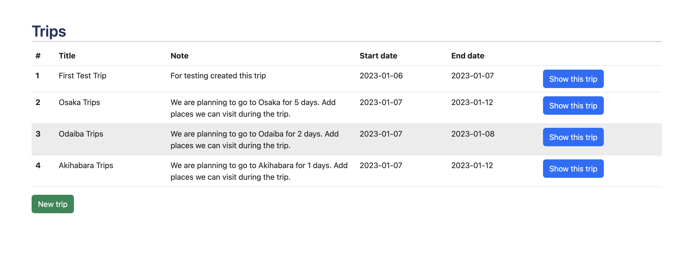
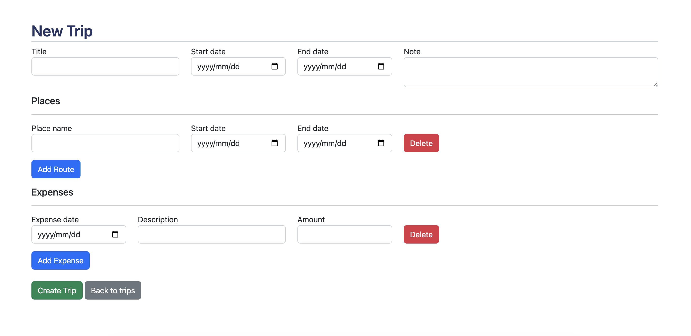
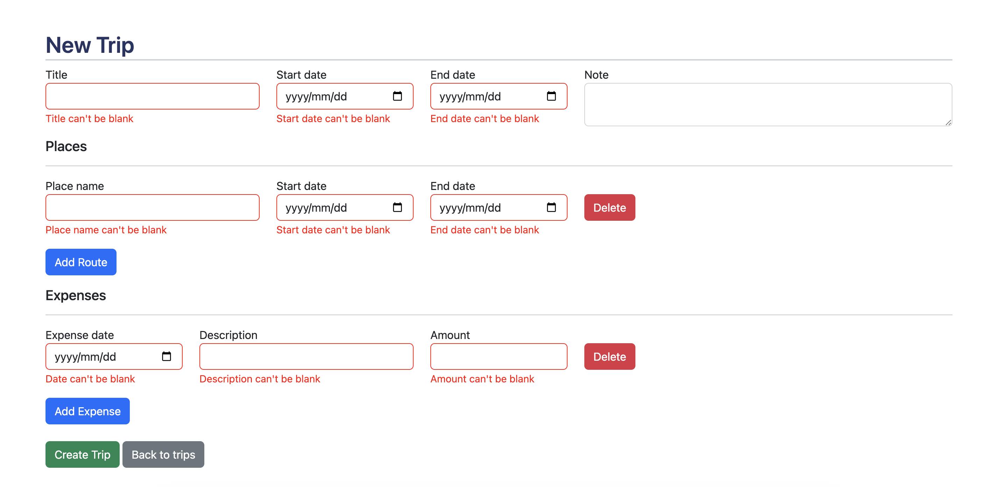
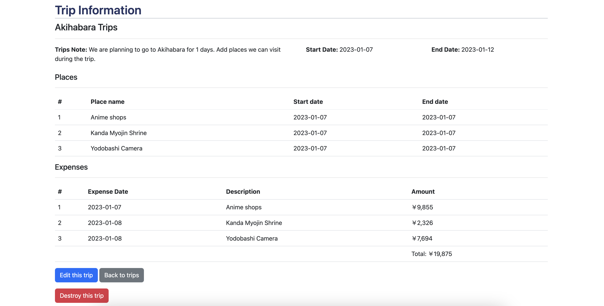
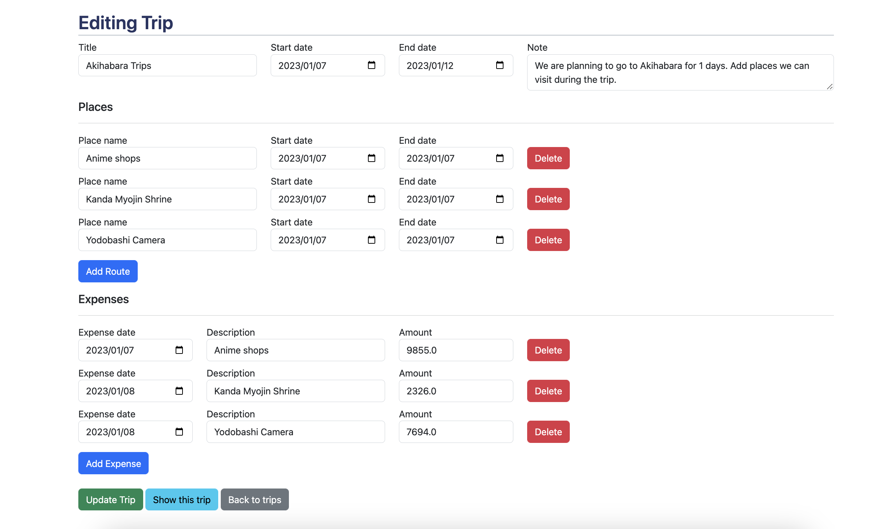

# Trip Planner

The Trip Planner is web application on where you can manage your trip by organizing routes and tracking your expenses.

## Features

- Trips List Screen
- Create trip with places and expenses
- Show Trip
- Update Trip
- Delete Trip
- Add or Delete places and expenses after trip create

## Technologies used

- Ruby on Rails (Ruby: 3.2.0, Rails: 7.0.4)
- jQuery
- Bootstrap5
- PostgreSQL@14 (Need to install PostgreSQL [Install PostgreSQL On macOS](https://www.postgresqltutorial.com/postgresql-getting-started/install-postgresql-macos/))

## Setup

```sh
# Clone Repository
git clone https://github.com/kananinirav/trip-planner.git

# Go to Folder
cd ./trip-planner

# Run bundle to install dependencies
bundle

# Create Database
rails db:create

# Run migration
rails db:migrate

# If you want to use a default seed data
rails db:seed

# Finally start server
rails s

# Open web application
open http://localhost:3000/

```

## Run Specs

```sh
bundle exec rspec
```

## Sample Images

### Trips List Screen



### Create trip with places and expenses



#### Validation Error



### Show Trip



### Update Trip


